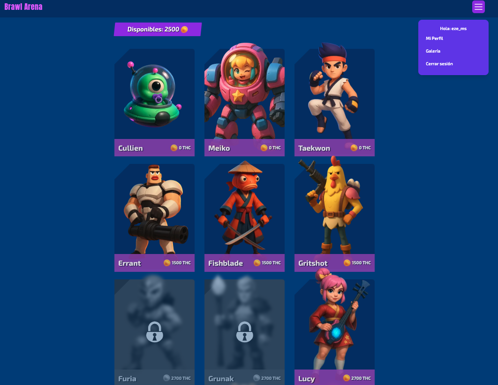
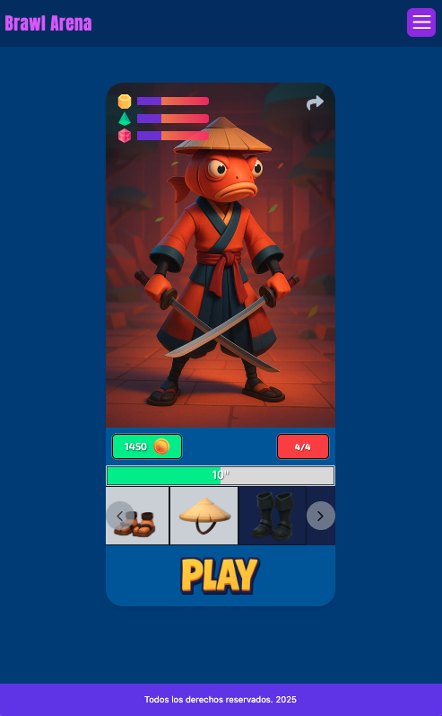
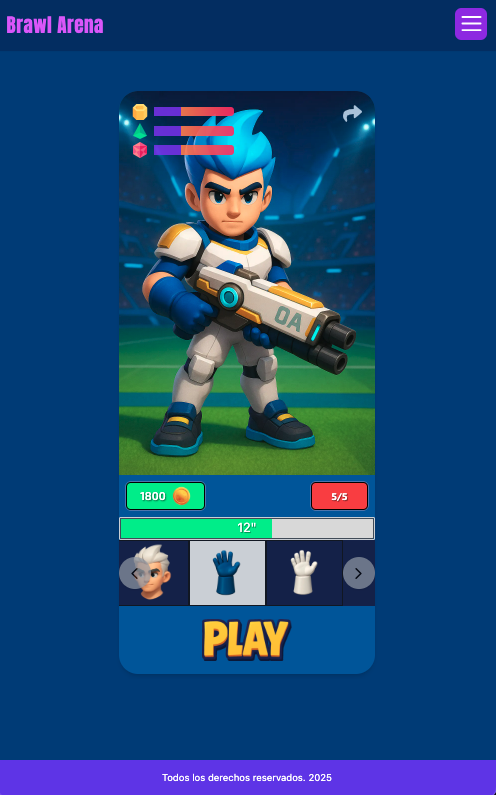
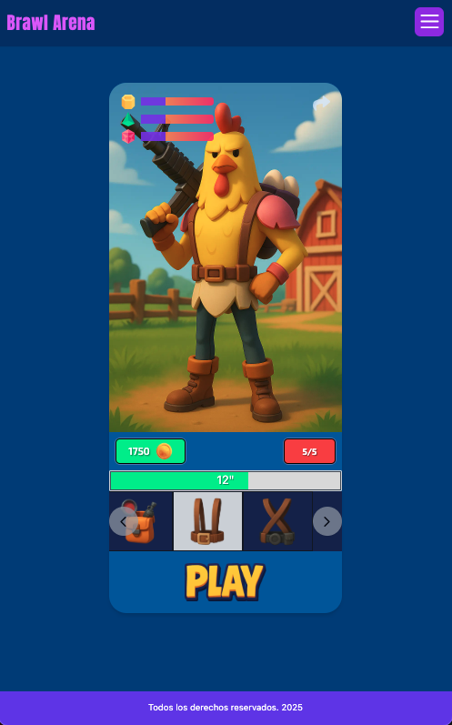
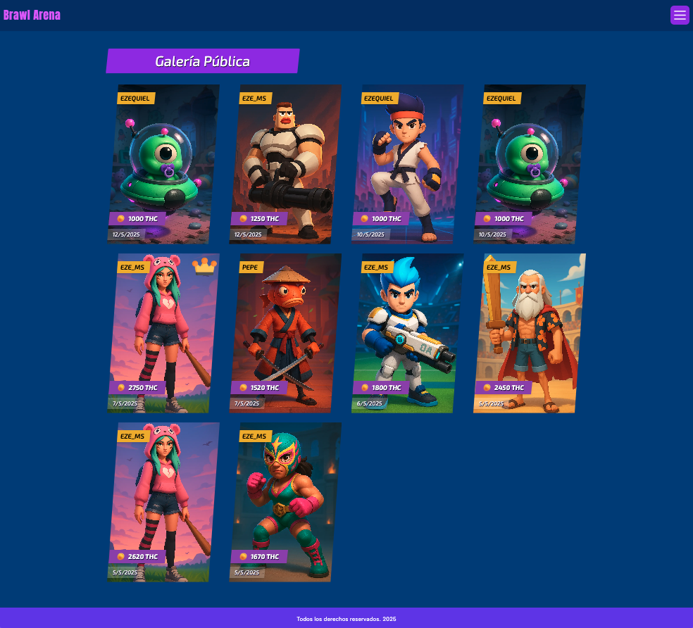
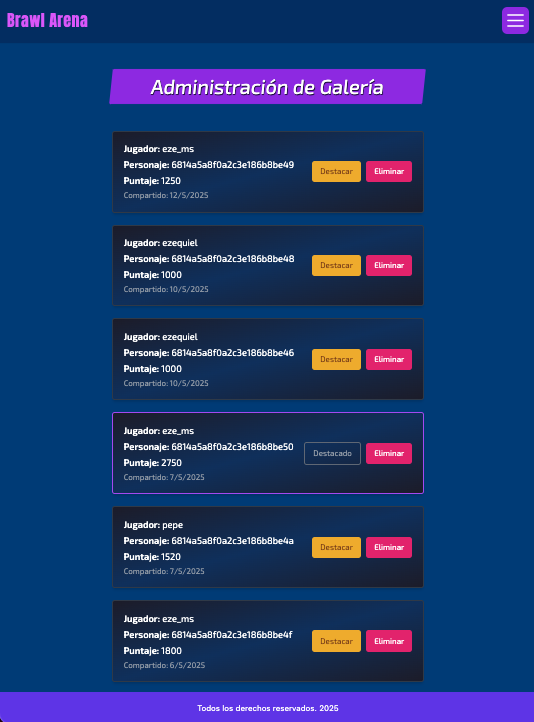

# Brawl Arena Front — Interfaz Reactiva de Montaje y Competencia


---

## 📄 Descripción

**Brawl Arena Front** es la interfaz web de la plataforma Brawl Arena, desarrollada con **React + TypeScript**. Permite a los jugadores montar personajes 3D con piezas modulares, activar poderes, desbloquear personajes mediante tokens y compartir modelos en una galería pública. También incluye una vista de administrador para gestionar contenido compartido.

El sistema integra autenticación con JWT, renderizado dinámico de componentes, navegación protegida y una interfaz responsive y animada.

---

## 🌐 Demo

🔗 [brawl-arena.app](https://brawl-arena-front.vercel.app/)

---

## 🖼️ Capturas

#### Vista dashboard jugador


#### Vista partida





#### Vista Galería pública


#### Vista administrador

---


## ✨ Funcionalidades

- Login y registro con persistencia de sesión (JWT)
- Visualización de personajes desbloqueados
- Montaje de modelos mediante drag & drop de piezas
- Visualización del poder del personaje en tiempo real
- Compartición de builds mediante modal confirmatorio
- Galería pública de modelos con indicador de destacado
- Desbloqueo de personajes usando tokens acumulados
- Panel de administración: destacar modelos y eliminarlos
- Control de acceso con `RequireUser` y `AuthContext`

---

## 💻 Tecnologías Utilizadas

- **React 18**
- **TypeScript**
- **React Router DOM**
- **Tailwind CSS**
- **Context API** (autenticación)
- **Fetch API** con wrapper personalizado (`fetchWithAuth`)
- **Vite**

---

## 📋 Requisitos

- Node.js 18 o superior
- API REST backend activo (`BrawlArena-back`)
- Cuenta de administrador (opcional)
- Navegador moderno

---

## 🔐 Autenticación
- El token JWT se guarda en localStorage y se valida en el inicio mediante AuthContext.
- Las peticiones a rutas protegidas se gestionan mediante fetchWithAuth, que inyecta automáticamente el token.

---

## 🧱 Estructura del Proyecto

```bash
brawlarena-front/
├── components/         # UI modular: modales, header, piezas, galería, etc.
├── views/              # Páginas principales: login, juego, galería, admin
├── context/            # AuthContext con validación y logout
├── constants/          # Rutas y endpoints
├── layouts/            # Layout principal con navegación
├── utils/              # fetchWithAuth para peticiones seguras
├── types/              # Tipado: personajes, piezas, modelos compartidos
├── router.tsx          # Configuración de rutas protegidas
├── main.tsx / App.tsx

```
---

## 🛠️ Instalación

```bash
git clone https://github.com/eze-ms/BrawlArena-front.git
```

### Instalar dependencias del backend
```bash
cd backend
npm install
```

### Iniciar frontend
```bash
npm run dev
```
---


© 2025. Proyecto desarrollado por Ezequiel Macchi Seoane